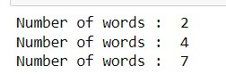
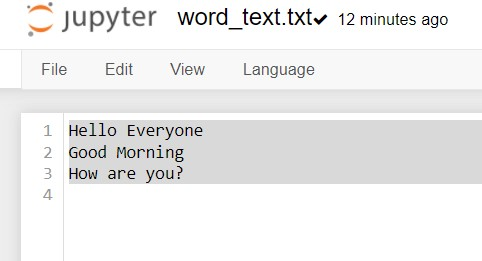

# Word-count
## AIM:
To write a python program for getting the word count from a text.
## EQUIPEMENT'S REQUIRED: 
PC
Anaconda - Python 3.7
## ALGORITHM: 
### Step 1:

### Step 2: 
 
### Step 3: 

### Step 4:  

### Step 5: 

### Step 6: 

## PROGRAM:
```
with open("word_text.txt","r")as fp:
    count=0
    for data in fp:
        x=data.split()
        for i in x:
            count+=1
        print("Number of words : ",count)
```

### OUTPUT:






## RESULT:
Thus the program is written to find the word count from a text.
